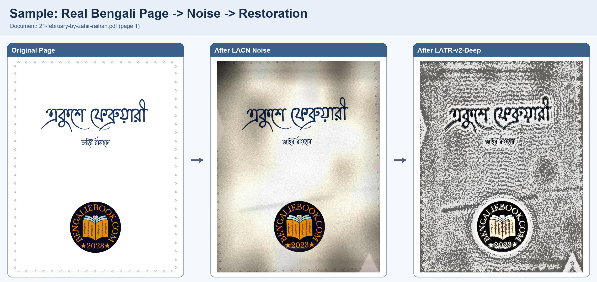

# BengalDocForge: LACN + LATR-v2-Deep

Single, publication-ready pipeline for Bengali document corruption and restoration:

- **LACN**: Layout-Adaptive Curriculum Noising (noise addition)
- **LATR-v2-Deep**: Layout-Aware Text Restoration with deep self-supervised test-time adaptation (noise removal)

---

## Package Stack (Clickable Blocks)

[](https://pymupdf.readthedocs.io/en/latest/)
[](https://pillow.readthedocs.io/en/stable/)
[](https://numpy.org/doc/stable/)
[](https://pytorch.org/docs/stable/index.html)
[](https://huggingface.co/docs/diffusers/index)
[](https://huggingface.co/docs/transformers/index)
[](https://github.com/opendatalab/DocLayout-YOLO)

Install:

```powershell
.\.venv\Scripts\python -m pip install -r .\requirements-noise-sota.txt
```

---

## Architecture


---

## Real Sample From Your Corpus

Source document used:

- `Books-Bengali/21-february-by-zahir-raihan.pdf` (page 1)

Generated artifacts:

- `docs/samples/sample_page_clean.png`
- `docs/samples/sample_page_noisy.png`
- `docs/samples/sample_page_restored.png`
- `docs/samples/sample_pipeline_triptych.png`

### End-to-End Visual



### Individual Views

| Original Page | After LACN Noise | After LATR-v2-Deep |
|---|---|---|
|  |  |  |

---

## Phase A: Noise Addition (LACN) - Detailed Process

Script: `add_bengali_document_noise_sota.py`

1. Collect input PDFs from `Books-Bengali`.
2. Sample a **document-level corruption profile** with non-deterministic seeds by default.
3. Rasterize each page with PyMuPDF at configured DPI.
4. Build page-level layout prior using saliency and optional DocLayout-YOLO.
5. Estimate baseline readability/OCR proxy for curriculum control.
6. Apply stochastic corruption families with dynamic order:
7. Apply `scan_geometry`.
8. Apply `uneven_illumination`.
9. Apply `paper_texture`.
10. Apply `ink_bleed_fade`.
11. Apply `sensor_compression`.
12. Apply `occlusion_damage`.
13. Apply `layout_adversarial_dropout` (novel, text-focused).
14. Apply `periodic_moire` (novel, scanner-frequency style).
15. Recompute readability after each stage.
16. Adapt per-page severity through curriculum gain to hit a target OCR-hardness interval.
17. Optionally run SDXL + ControlNet refinement for a controlled subset of pages.
18. Rebuild noisy PDF and write experiment metadata:
19. Write `noise_manifest.csv`.
20. Write `run_summary.json`.

### Noise Addition Command (recommended)

```powershell
.\.venv\Scripts\python .\add_bengali_document_noise_sota.py `
  --input .\Books-Bengali `
  --output .\Books-Bengali-Noisy-SOTA `
  --pipeline-mode hybrid `
  --workers 1 `
  --overwrite
```

### Optional SOTA-Heavy Addition Command

```powershell
.\.venv\Scripts\python .\add_bengali_document_noise_sota.py `
  --input .\Books-Bengali `
  --output .\Books-Bengali-Noisy-SOTA `
  --pipeline-mode sota `
  --enable-layout-prior `
  --enable-ocr-critic `
  --enable-diffusion-refiner `
  --workers 1 `
  --overwrite
```

---

## Phase B: Noise Removal (LATR-v2-Deep) - Detailed Process

Script: `remove_bengali_document_noise_sota.py`

1. Read noisy PDFs from the noised output folder.
2. Rasterize each page.
3. Compute saliency and readability/OCR diagnostics.
4. Run illumination flattening.
5. Run FFT periodic artifact suppression.
6. Launch **self-supervised neural test-time adaptation** (deep branch):
7. Train a lightweight U-Net on the current page only, using blind-spot masking.
8. Optimize masked reconstruction objective.
9. Add OCR-aligned foreground/background contrast objective.
10. Add edge consistency and total variation regularization.
11. Use test-time augmentation ensemble for a stabilized neural candidate.
12. Run parallel classical branch:
13. Layout-aware denoise blend.
14. Ink stroke reconstruction.
15. Build candidate bank from neural and classical outputs.
16. Rank candidates via OCR/readability multi-objective scoring.
17. Select best candidate.
18. Optionally apply SDXL + ControlNet restoration cleanup.
19. Rebuild restored PDF and write experiment metadata:
20. Write `denoise_manifest.csv`.
21. Write `denoise_summary.json`.

### Noise Removal Command (deep default path)

```powershell
.\.venv\Scripts\python .\remove_bengali_document_noise_sota.py `
  --input .\Books-Bengali-Noisy-SOTA `
  --output .\Books-Bengali-Denoised-SOTA `
  --enable-ocr-critic `
  --neural-steps 42 `
  --workers 1 `
  --overwrite
```

### Strict Deep Requirement Command

```powershell
.\.venv\Scripts\python .\remove_bengali_document_noise_sota.py `
  --input .\Books-Bengali-Noisy-SOTA `
  --output .\Books-Bengali-Denoised-SOTA `
  --require-deep-learning `
  --enable-ocr-critic `
  --workers 1 `
  --overwrite
```

If `torch` is unavailable and `--require-deep-learning` is not set, the pipeline falls back gracefully and records the backend in manifest columns (`neural_backend`, `ocr_backend`, `diffusion_backend`).

---

## Key Outputs

Noise addition output folder:

- `*__noisy.pdf`
- `noise_manifest.csv`
- `run_summary.json`

Noise removal output folder:

- `*__denoised.pdf`
- `denoise_manifest.csv`
- `denoise_summary.json`

---

## Novelty Summary (Paper Positioning)

1. Non-deterministic layout-adaptive corruption curriculum (LACN).
2. Text-critical adversarial dropout and periodic moire synthesis for OCR stress.
3. Separate deep restoration pipeline with self-supervised page-wise neural adaptation (LATR-v2-Deep).
4. Hybrid neural + classical candidate bank with OCR-aware ranking.
5. Optional diffusion cleanup as a controlled final stage.

---

## Research Anchors

- DocRes (CVPR 2024): https://arxiv.org/abs/2405.04408
- DocRes code: https://github.com/ZZZHANG-jx/DocRes
- Uni-DocDiff (arXiv 2025): https://arxiv.org/abs/2508.04055
- PromptIR (NeurIPS 2023): https://proceedings.neurips.cc/paper_files/paper/2023/hash/e187897ed7780a579a0d76fd4a35d107-Abstract-Conference.html
- PromptIR code: https://github.com/va1shn9v/PromptIR
- Restormer code: https://github.com/swz30/Restormer
