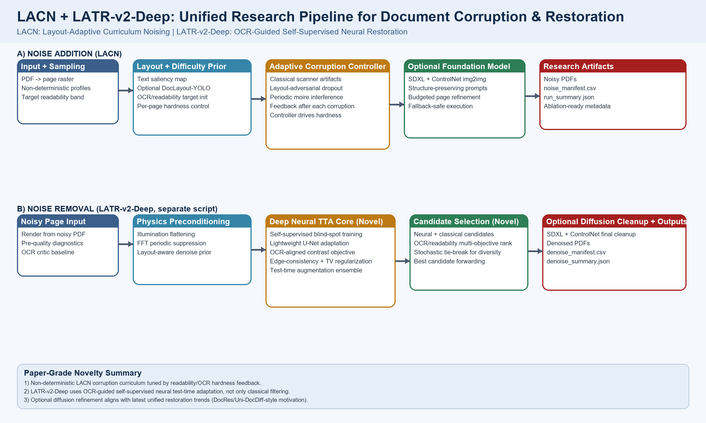
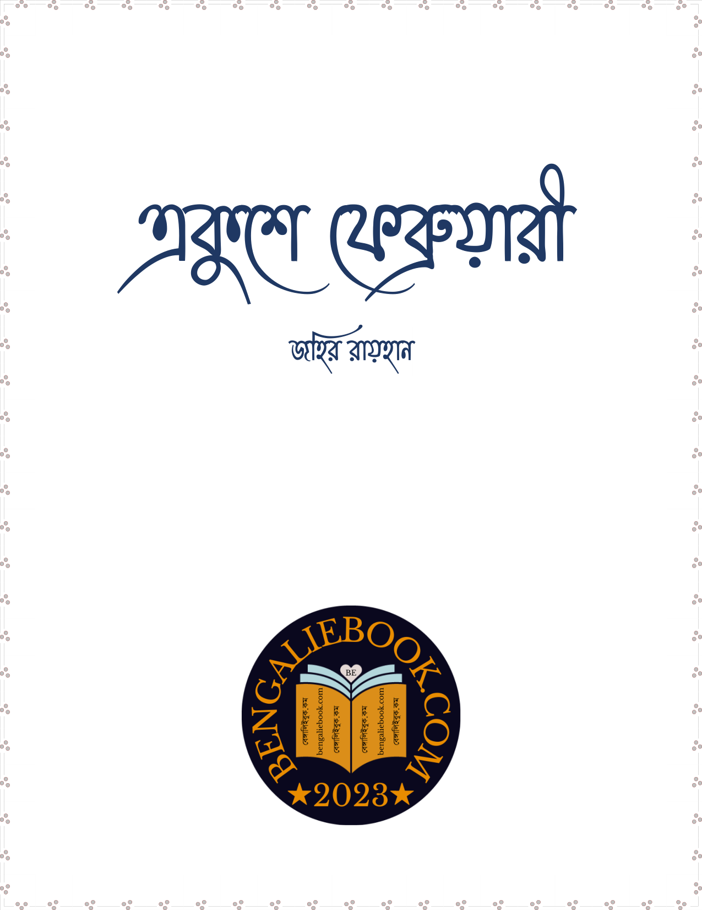
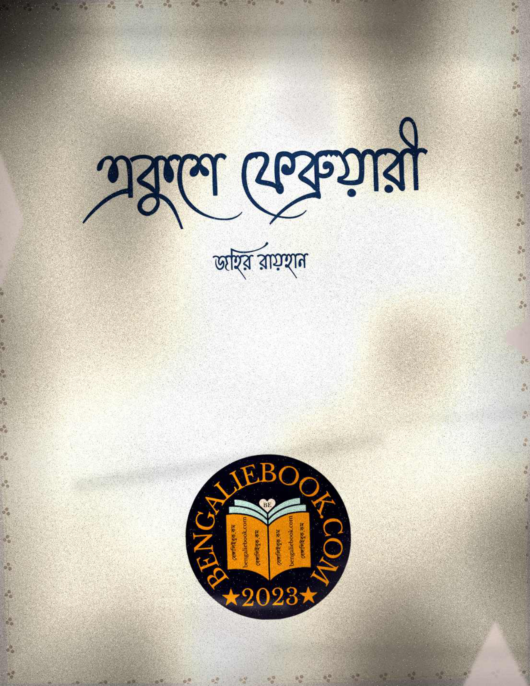
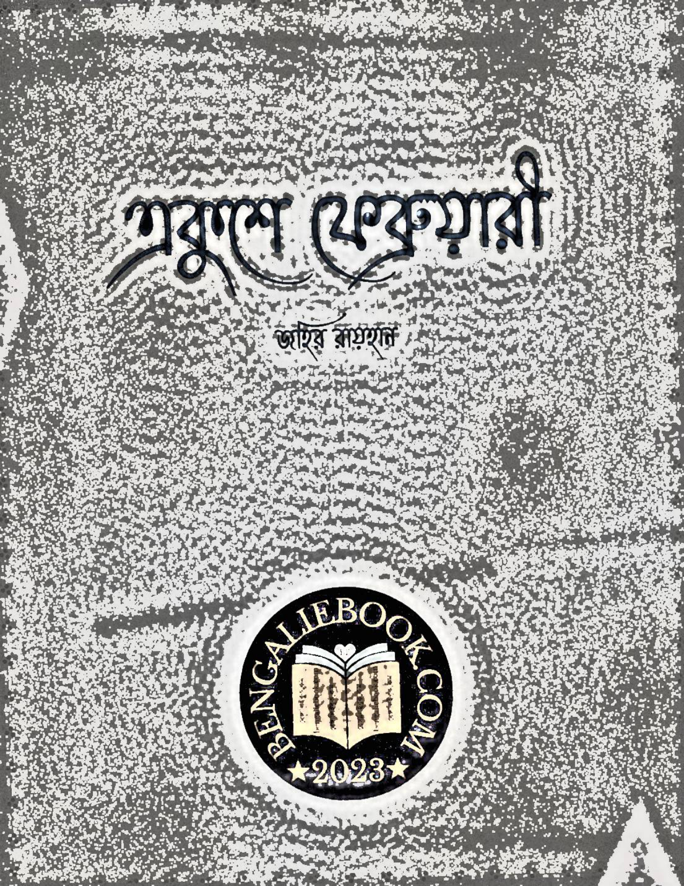

# BengalDocForge: LACN + LATR-v2-Deep

Single, publication-ready pipeline for Bengali document corruption and restoration:

- **LACN**: Layout-Adaptive Curriculum Noising (noise addition)
- **LATR-v2-Deep**: Layout-Aware Text Restoration with deep self-supervised test-time adaptation (noise removal)

---

## Package Stack (Clickable Blocks)

[](https://pymupdf.readthedocs.io/en/latest/)
[](https://pillow.readthedocs.io/en/stable/)
[](https://numpy.org/doc/stable/)
[](https://pytorch.org/docs/stable/index.html)
[](https://huggingface.co/docs/diffusers/index)
[](https://huggingface.co/docs/transformers/index)
[](https://github.com/opendatalab/DocLayout-YOLO)

Install:

```powershell
.\.venv\Scripts\python -m pip install -r .\requirements-noise-sota.txt
```

---

## Architecture



---

## Real Sample From Your Corpus

Source document used:

- `Books-Bengali/21-february-by-zahir-raihan.pdf` (page 1)

Generated artifacts:

- `docs/samples/sample_page_clean.png`
- `docs/samples/sample_page_noisy.png`
- `docs/samples/sample_page_restored.png`
- `docs/samples/sample_pipeline_triptych.png`

### End-to-End Visual


### Individual Views

| Original Page | After LACN Noise | After LATR-v2-Deep |
|---|---|---|
|  |  |  |

---

## Phase A: Noise Addition (LACN) - Detailed Process

Script: `add_bengali_document_noise_sota.py`

1. **Collect input PDFs from `Books-Bengali`.**  
   This defines the clean source corpus and keeps the experiment tied to real Bengali layouts rather than synthetic text pages.
2. **Sample a document-level corruption profile (non-deterministic by default).**  
   Each document receives a unique random corruption identity so model robustness is tested against diverse and unpredictable degradation patterns.
3. **Rasterize each page with PyMuPDF at configured DPI.**  
   Converting PDF vectors to images creates a pixel-space canvas where scanner-like noise can be realistically injected.
4. **Build a page-level layout prior (saliency + optional DocLayout-YOLO).**  
   This identifies text-critical zones so corruption is not uniformly random and can target meaningful reading regions.
5. **Estimate baseline readability/OCR proxy.**  
   The baseline score acts as a control signal for how hard or easy the page currently is for recognition.
6. **Apply stochastic corruption families in dynamic order.**  
   Randomized ordering avoids fixed artifact signatures and improves generalization pressure for downstream OCR models.
7. **Apply `scan_geometry`.**  
   Adds skew, shifts, and scanner framing artifacts that mimic imperfect physical page capture.
8. **Apply `uneven_illumination`.**  
   Simulates non-uniform lighting, shadows, and vignetting seen in low-quality scans and phone captures.
9. **Apply `paper_texture`.**  
   Injects fibers, grain, and stain-like paper effects to challenge binarization and background normalization.
10. **Apply `ink_bleed_fade`.**  
    Models bleeding and fading so character boundaries become less reliable for OCR edge detectors.
11. **Apply `sensor_compression`.**  
    Adds row noise, blur, and JPEG-like quantization artifacts that emulate consumer scanning pipelines.
12. **Apply `occlusion_damage`.**  
    Introduces partial masking/smearing to replicate damaged archival or physically degraded documents.
13. **Apply `layout_adversarial_dropout` (novel, text-focused).**  
    Drops or distorts information in text-important zones to explicitly stress OCR failure modes.
14. **Apply `periodic_moire` (novel, scanner-frequency style).**  
    Adds periodic interference patterns commonly observed when document textures interact with sampling grids.
15. **Recompute readability after each stage.**  
    Continuous measurement keeps corruption progression controlled instead of blindly increasing severity.
16. **Adapt per-page severity through curriculum gain toward target OCR-hardness.**  
    The controller pushes pages into a desired difficulty band, enabling consistent benchmark hardness across documents.
17. **Optionally run SDXL + ControlNet refinement on selected pages.**  
    This optional SOTA branch adds high-fidelity, structured degradation while preserving layout semantics.
18. **Rebuild noisy PDF and store experiment metadata.**  
    Output PDFs are ready for training/evaluation and aligned with tracked generation settings.
19. **Write `noise_manifest.csv`.**  
    Per-document metadata logs noise families, seeds/modes, quality settings, and measurable statistics.
20. **Write `run_summary.json`.**  
    Corpus-level aggregates support paper tables, ablations, and reproducibility reporting.

### Noise Addition Command (recommended)

```powershell
.\.venv\Scripts\python .\add_bengali_document_noise_sota.py `
  --input .\Books-Bengali `
  --output .\Books-Bengali-Noisy-SOTA `
  --pipeline-mode hybrid `
  --workers 1 `
  --overwrite
```

### Optional SOTA-Heavy Addition Command

```powershell
.\.venv\Scripts\python .\add_bengali_document_noise_sota.py `
  --input .\Books-Bengali `
  --output .\Books-Bengali-Noisy-SOTA `
  --pipeline-mode sota `
  --enable-layout-prior `
  --enable-ocr-critic `
  --enable-diffusion-refiner `
  --workers 1 `
  --overwrite
```

---

## Phase B: Noise Removal (LATR-v2-Deep) - Detailed Process

Script: `remove_bengali_document_noise_sota.py`

1. **Read noisy PDFs from the noised output folder.**  
   This binds restoration directly to the generated corruption distribution used in Phase A.
2. **Rasterize each page.**  
   Page-wise raster tensors are required for both neural adaptation and classical restoration operators.
3. **Compute saliency and readability/OCR diagnostics.**  
   Diagnostics provide region awareness and quality baselines before any restoration step.
4. **Run illumination flattening.**  
   Removes broad background shading so text/background contrast can be recovered more reliably.
5. **Run FFT periodic artifact suppression.**  
   Targets scanner-frequency or moire-like periodic noise in the spectral domain.
6. **Launch self-supervised neural test-time adaptation (deep branch).**  
   A page-specific model is adapted online so restoration parameters match the exact noise pattern of each page.
7. **Train a lightweight U-Net on the current page with blind-spot masking.**  
   The network learns denoising behavior without clean ground truth by predicting masked pixels from context.
8. **Optimize masked reconstruction objective.**  
   This anchors learning to signal consistency and prevents arbitrary image hallucination.
9. **Add OCR-aligned foreground/background contrast objective.**  
   The model is nudged to improve separability between text strokes and paper regions.
10. **Add edge consistency and total variation regularization.**  
    Preserves character structure while suppressing unstable texture noise.
11. **Use test-time augmentation ensemble for a stabilized neural candidate.**  
    Flip-based ensembling reduces variance and improves robustness of page-level restoration.
12. **Run a parallel classical branch.**  
    Classical operators remain useful for deterministic cleanup and complement neural outputs.
13. **Apply layout-aware denoise blend.**  
    Denoising is stronger in background regions while protecting text-rich regions from over-smoothing.
14. **Apply ink stroke reconstruction.**  
    Reinforces weakened text strokes and improves visual legibility for OCR.
15. **Build a candidate bank from neural and classical outputs.**  
    Multiple restoration hypotheses are retained rather than committing early to one branch.
16. **Rank candidates with OCR/readability + cleanliness multi-objective scoring.**  
    Selection favors pages that are both readable and visibly cleaner (less residual background noise).
17. **Select the best candidate.**  
    The highest-scoring restoration is taken as the final reconstruction for that page.
18. **Optionally apply SDXL + ControlNet restoration cleanup.**  
    Optional diffusion refinement can remove remaining structured artifacts while respecting layout.
19. **Rebuild restored PDF and persist metadata.**  
    Produces deployable restored documents with full provenance for experiments.
20. **Write `denoise_manifest.csv`.**  
    Logs page/document restoration quality changes and backend choices.
21. **Write `denoise_summary.json`.**  
    Provides run-level aggregates for quantitative evaluation and paper reporting.

### Noise Removal Command (deep default path)

```powershell
.\.venv\Scripts\python .\remove_bengali_document_noise_sota.py `
  --input .\Books-Bengali-Noisy-SOTA `
  --output .\Books-Bengali-Denoised-SOTA `
  --enable-ocr-critic `
  --neural-steps 42 `
  --workers 1 `
  --overwrite
```

### Strict Deep Requirement Command

```powershell
.\.venv\Scripts\python .\remove_bengali_document_noise_sota.py `
  --input .\Books-Bengali-Noisy-SOTA `
  --output .\Books-Bengali-Denoised-SOTA `
  --require-deep-learning `
  --enable-ocr-critic `
  --workers 1 `
  --overwrite
```

If `torch` is unavailable and `--require-deep-learning` is not set, the pipeline falls back gracefully and records the backend in manifest columns (`neural_backend`, `ocr_backend`, `diffusion_backend`).

---

## Key Outputs

Noise addition output folder:

- `*__noisy.pdf`
- `noise_manifest.csv`
- `run_summary.json`

Noise removal output folder:

- `*__denoised.pdf`
- `denoise_manifest.csv`
- `denoise_summary.json`

---

## Novelty Summary (Paper Positioning)

1. **Non-deterministic layout-adaptive corruption curriculum (LACN).**  
   Corruption is randomized but controlled by readability feedback, so each page is unique yet benchmark-consistent.
2. **Text-critical adversarial dropout + periodic moire synthesis.**  
   The noising process specifically attacks OCR-sensitive areas and scanner-frequency weaknesses.
3. **Separate deep restoration pipeline (LATR-v2-Deep).**  
   Restoration is not a reverse filter chain; it is an independent, train-at-test-time denoising strategy.
4. **Hybrid neural + classical candidate bank with OCR-aware ranking.**  
   Multiple restorations are scored and selected, improving reliability over single-path restoration.
5. **Optional diffusion cleanup as a controlled final stage.**  
   Diffusion is used as a bounded refinement step, not an uncontrolled black-box replacement.

---

## Research Anchors

- DocRes (CVPR 2024): https://arxiv.org/abs/2405.04408
- DocRes code: https://github.com/ZZZHANG-jx/DocRes
- Uni-DocDiff (arXiv 2025): https://arxiv.org/abs/2508.04055
- PromptIR (NeurIPS 2023): https://proceedings.neurips.cc/paper_files/paper/2023/hash/e187897ed7780a579a0d76fd4a35d107-Abstract-Conference.html
- PromptIR code: https://github.com/va1shn9v/PromptIR
- Restormer code: https://github.com/swz30/Restormer
